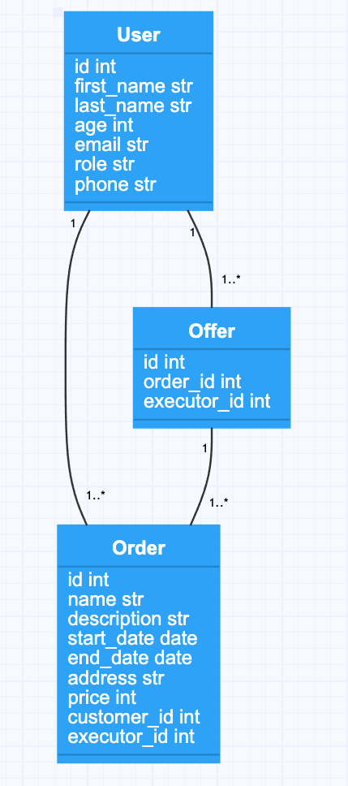

**Шаг 1**

Создайте модели под следующую задачу:

- Есть пользователь, он может быть как заказчиком, так и исполнителем.
- Пользователь с ролью Заказчик может создать Заказ.
- Пользователь с ролью Исполнитель может откликнуться на Заказ и предложить выполнить его (Offer). 

UML-схема классов поможет вам создать модели, она описывает сущности и связи между ними.

**Шаг 2**

Вот данные в JSON-виде, положите их в базу, используя модели.

**Шаг 3**

Создайте представление для пользователей, которое обрабатывало бы `GET`-запросы получения всех пользователей `/users` и одного пользователя по идентификатору `/users/1`.

**Шаг 4**

Создайте представление для заказов, которое обрабатывало бы `GET`-запросы получения всех заказов `/orders` и заказа по идентификатору `/orders/1`.

**Шаг 5**

Создайте представление для предложений, которое обрабатывало бы `GET`-запросы получения всех предложений `/offers` и предложения по идентификатору `/offers/<id>`.

**Шаг 6**

Реализуйте создание пользователя `user` посредством метода POST на URL `/users`  для users.
Реализуйте обновление пользователя `user` посредством метода PUT на URL `/users/<id>`  для users. В Body будет приходить JSON со всеми полями для обновление заказа.
Реализуйте удаление пользователя `user` посредством метода DELETE на URL `/users/<id>` для users.

**Шаг 7**

Реализуйте создание заказа `order` посредством метода POST на URL `/orders`  для orders.
Реализуйте обновление заказа `order` посредством метода PUT на URL `/orders/<id>`  для orders. В Body будет приходить JSON со всеми полями для обновление заказа.
Реализуйте удаление заказа `order` посредством метода DELETE на URL `/orders/<id>` для orders.

**Шаг 8**

Реализуйте создание предложения `offer` посредством метода `POST` на URL `/offers` для `offers`.
Реализуйте обновление предложения `offer` посредством метода `PUT` на URL `/offers/<id>` для `offers`. В `Body` будет приходить `JSON` со всеми полями для обновление предложения.
Реализуйте удаление предложения `offer` посредством метода `DELETE` на URL `/offers/<id>` для `offers`.